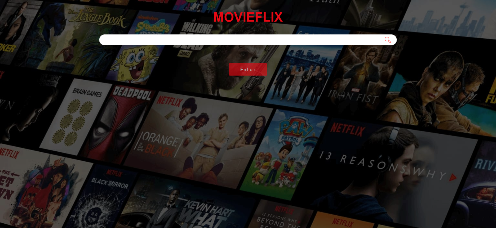

# Movieflix

Content based Movie Recommendation System with sentiment Analysis

## About the Recommender System

Content Based Recommender System recommends movies similar to the movie user likes and analyses the sentiments on the reviews given by the user for that movie.

The details of the movies(title, genre, runtime, rating, poster, etc) are fetched using an API by TMDB, https://www.themoviedb.org/documentation/api, and using the IMDB id of the movie in the API, I did web scraping to get the reviews given by the user in the IMDB site using `beautifulsoup4` and performed sentiment analysis on those reviews.

This web application is my submission for the month long challenge to build a Movie Recommendation System in Engage'22, a mentorship program conducted by Microsoft.

## Video Demo

## How to get the API key?

Create an account in https://www.themoviedb.org/, click on the `API` link from the left hand sidebar in your account settings and fill all the details to apply for API key. If you are asked for the website URL, just give "NA" if you don't have one. You will see the API key in your `API` sidebar once your request is approved.

## How to run the project?

1. Clone or download this repository to your local machine.
2. Install all the libraries mentioned in the requirements.txt file with the command `pip install -r requirements.txt`.
3. Get your API key from https://www.themoviedb.org/. (Refer the above section on how to get the API key)
4. Replace 'YOUR_API_KEY' in **both** the places (line no. 23 and 43) of `static/recommend.js` file and hit save.(I have saved my api key for reference)
5. Open your terminal/command prompt from your project directory and run the file `myapp.py` by executing the command `python myapp.py`.
6. Go to your browser and type `http://127.0.0.1:5000/` in the address bar.

## Important Note-
I couldnt upload 1 file named "credits.csv" on github due to its size(181 mb).please download it from the link below the add it to the datasets folder.
https://drive.google.com/file/d/1hUdffFjZOhon3Exmka00S2mEGxt_8nOx/view?usp=sharing

## How to run the ipynb files on google colab?( I have made them using google colab due to my computational limitations.)
Here we have two .iypnb files (Sentiment_Analysis.ipynb and movie_recommender_systems.ipynb)
For movie_recommender_systems.ipynb-
1.When we open these files there will be a button on top for open the file in google colab[click on that].
2.Simply mount google drive by running the first cell present.

3.Upload the datasets to your google drive(https://github.com/aditya080101/movieflixrec/tree/main/datasets)
4.provide the path to the cell shown below.

Similarly we can run  Sentiment_Analysis.ipynb on google colab

## How to run the ipynb files Locally?
Download the datasets and Run the movie-recommender-systems using jupyter notebook.ipynb(https://github.com/aditya080101/movieflixrec/blob/main/movie-recommender-systems%20using%20jupyter.ipynb).
Similarly Run Sentiment_analysis_jupyter.ipynb locally.(https://github.com/aditya080101/movieflixrec/blob/main/Sentiment_analysis_jupyter.ipynb)

## Types of recommender systems-
1.Content-based filtering uses similarities in products, services, or content features, as well as information accumulated about the user to make recommendations.
2.Collaborative filtering relies on the preferences of similar users to offer recommendations to a particular user.

## Why use content-based filtering?
1.No data from other users is required to start making recommendations. Unlike collaborative filtering, content-based filtering doesn’t need data from other users to create recommendations. Once a user has searched , a content-based filtering system can begin making relevant recommendations. 
2.Recommendations are highly relevant to the user. Content-based recommenders can be highly tailored to the user’s interests, including recommendations for niche items, because the method relies on matching the characteristics or attributes of a database object with the user’s profile.
3.Recommendations are transparent to the user. Highly relevant recommendations project a sense of openness to the user, bolstering their trust level in offered recommendations. Comparatively, with collaborative filtering, instances are more likely to occur where users don’t understand why they see specific recommendations.
4.You avoid the “cold start” problem. Collaborative filtering creates a potential cold start scenario when a new website or community has few new users and lacks user connections. Although content-based filtering needs some initial inputs from users to start making recommendations, the quality of early recommendations is generally better than a collaborative system that requires the addition and correlation of millions of data points before becoming optimized.
5.Content-based filtering systems are generally easier to create. The data science behind a content-based filtering system is relatively straightforward compared to collaborative filtering systems intended to mimic user-to-user recommendations. The real work in content-based filtering is assigning the attributes.

## Similarity Score : 

   How does it decide which item is most similar to the item user likes? Here come the similarity scores.
   
   It is a numerical value ranges between zero to one which helps to determine how much two items are similar to each other on a scale of zero to one. This similarity score is obtained measuring the similarity between the text details of both of the items. So, similarity score is the measure of similarity between given text details of two items. This can be done by cosine-similarity.

## How Cosine Similarity works?
  Cosine similarity is a metric used to measure how similar the documents are irrespective of their size. Mathematically, it measures the cosine of the angle between two vectors projected in a multi-dimensional space. The cosine similarity is advantageous because even if the two similar documents are far apart by the Euclidean distance (due to the size of the document), chances are they may still be oriented closer together. The smaller the angle, higher the cosine similarity.
  
  
  More about Cosine Similarity : [Understanding the Math behind Cosine Similarity](https://www.machinelearningplus.com/nlp/cosine-similarity/)
  
## Features-
1.The model doesn't need any data about other users, since the recommendations are specific to this user. This makes it easier to scale to a large number of users.
2.The model can capture the specific interests of a user, and can recommend niche items that very few other users are interested in.
3.The model gives the whole details about the Movie we want to get Recommendations for.
4.The model also does Sentiment Analysis on the movies(gives positive and negative sentiments)
5.The modal also gives the details about the cast of the movies (their Birthday , place of birth and their biography)
6.Autocomplete Feature has been added in the search bar.it will auto suggest the movie as you type the names of the movie.(If the movie you want isn't auto-suggested as you type, don't worry. Simply enter the title of the film and hit "enter." Even if you make a few typo errors, you'll probably Be fine).
7.Ajax requests have been used to get the details about the movie and cast to fasten up the loading of web Application.
8.Clean and Simple UI Design.

## Layout and flow of the application

## Doing the project in phases-

## Phase 0-
The main focus was to :
1.Decide which project to work on
2.Get familiar with the technologies and programming languages required for the project .
3.Develop a rudimentary idea of what features I wanted to include in the application.

## Phase 1-
1.Studying about different types of filtering algorithms.
2.Develop a content based filtering algorithms using cosine similarity.
3.sentiment analysis on imdb dataset of 50k movies.

## Phase 2: 
1.On acheiving most targets in the previous sprint I went on to integrate all of them in a good UI .
2.started thinking and implementing more complex features in the app.

## Phase 3:
2.Added details of the movies.
3.Added details of the Cast and crew.
4.scraped reviews of the movies from imdb and did sentiment analysis.
5.Improving UI of the web application.

 

## What's next?
1.Improving the UI design.
2.Adding the Names of Popular Movies on the home page which I got using Simple Recommender System.
3.Adding the names of popular Movies based of Genre on home page.
4.Making a Hybrid Recommendation system which uses both Content filtering and collaborative filtering algorithms.
5.Improving Sentiment Analysis further to get accurate results.
6.Get the trailer for the recommended movies.

